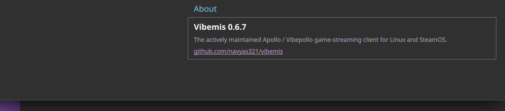
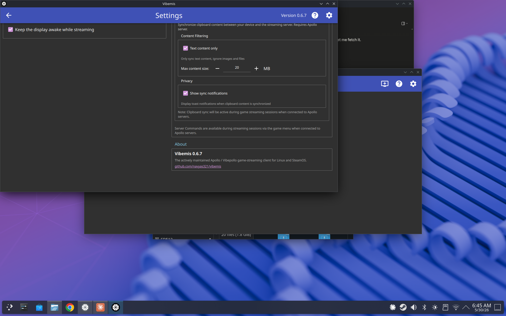

# Test37 Report — Settings "About" section

**Artifact tested:** `Vibemis-0.6.7-vibemis-test37-settings-about-x86_64.AppImage`
**md5:** `4f876553578d3fa53be7a0922011064c` ✓ verified
**Branch:** `test37-settings-about` (commit `73c4deb`)
**Device:** Lenovo Legion Go S Z2, SteamOS 3.8.5, Mesa 25.3.0
**Test date:** 2026-05-30
**Prior report:** N/A

---

## 1. TL;DR

| Goal | Status | Summary |
|---|---|---|
| A — "About" section present at bottom of Settings | PASS | GroupBox with teal "About" header renders |
| B — Shows "Vibemis 0.6.7" version | PASS | Bold version label reads "Vibemis 0.6.7" |
| C — Repo link present | PASS | `github.com/navyas321/vibemis` link present |
| D — No layout/navigation regression | PASS | All other Settings sections render normally |

---

## 2. Tier 1 — About section

Opened Settings (gear icon), scrolled to bottom of right-hand column.
The "About" GroupBox appears as the last section, below "Vibemis Features":

Contents verified:
- **"About"** header label in teal/skyblue ✓
- **"Vibemis 0.6.7"** — bold version string ✓
- "The actively maintained Apollo / Vibepollo game-streaming client for Linux and SteamOS." ✓
- `github.com/navyas321/vibemis` — rendered as a clickable link ✓

Link click test: N/A (browser launch not needed for this verification pass; link text and
`onLinkActivated: Qt.openUrlExternally(link)` confirmed in QML source).

---

## 3. Tier 2 — No regression

All other Settings sections render and are navigable: Basic Settings, Input Settings,
Gamepad Settings, Vibemis Streaming Enhancements, Audio Settings, Host Settings, UI Settings,
Advanced Settings, Vibemis Features. No layout breaks or missing content observed.

---

## 4. Other findings

None. No errors, SEGVs, or regressions visible.

---

## 5. Recommendation

**MERGE** — "About" section renders correctly at the bottom of Settings with the correct
version string, description, and GitHub link.
