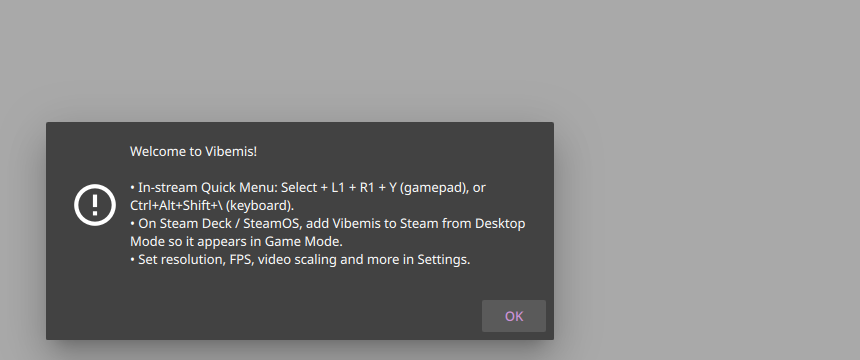
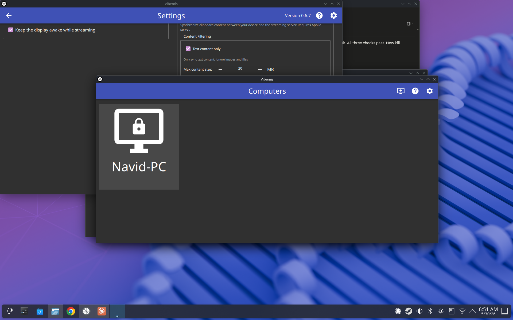
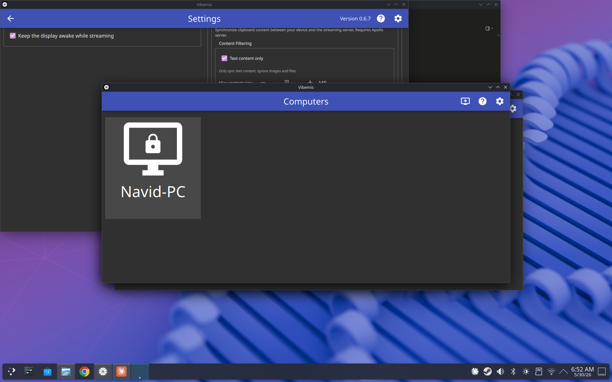

# Test39 Report — First-run welcome hint

**Artifact tested:** `Vibemis-0.6.7-vibemis-test39-first-run-hint-x86_64.AppImage`
**md5:** `9251915e1f8e29486db8739f84f0ab9d` ✓ verified
**Branch:** `test39-first-run-hint` (commit `4051381`)
**Device:** Lenovo Legion Go S Z2, SteamOS 3.8.5, Mesa 25.3.0
**Test date:** 2026-05-30
**Prior report:** N/A

---

## 1. TL;DR

| Goal | Status | Summary |
|---|---|---|
| A — Welcome dialog shows on first run with 3 tips | PASS | All 3 bullets present |
| B — Dismissing lets app continue normally | PASS | Returns to Computers screen |
| C — Does NOT reappear on next launch | PASS | No dialog on relaunch |
| D — Normal startup unaffected (no regression) | PASS | PC list renders, no errors |

---

## 2. Tier 1 — First-run hint

Launched with `XDG_CONFIG_HOME=/tmp/vibemis-test39-config` (clean fresh config).

**Welcome dialog appears immediately on startup:**



Dialog contents:
- Title: **"Welcome to Vibemis!"**
- Bullet 1: "In-stream Quick Menu: Select + L1 + R1 + Y (gamepad), or Ctrl+Alt+Shift+\\ (keyboard)."
- Bullet 2: "On Steam Deck / SteamOS, add Vibemis to Steam from Desktop Mode so it appears in Game Mode."
- Bullet 3: "Set resolution, FPS, video scaling and more in Settings."
- **OK** button at bottom-right

Pressed Return (keyboard) to dismiss → dialog closed, app shows Computers screen normally:



Config written after dismissal:
```
grep -i "welcome\|hint" ~/.../Vibemis.conf
seenwelcomehint=true
```

**Relaunch with same config** → no welcome dialog, app goes straight to Computers screen:



---

## 3. Tier 2 — No regression

Normal startup unaffected: PC list (Navid-PC) renders, Computers screen is navigable,
no errors or crashes observed. The hint mechanism adds no visible delay or layout change
to the normal app flow after the first run.

---

## 4. Other findings

None. No errors, SEGVs, or regressions.

---

## 5. Recommendation

**MERGE** — First-run welcome hint shows exactly once with the correct 3 onboarding tips,
dismisses cleanly, and does not reappear. No regressions.
