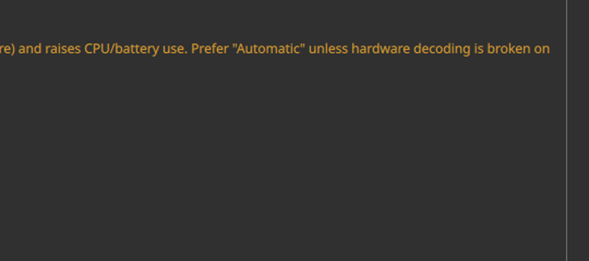
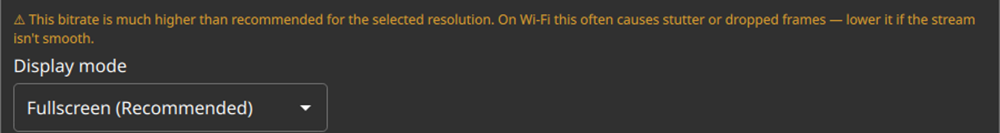
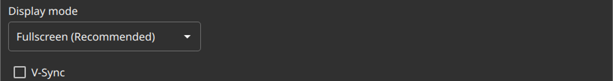

# Test53 Report — Settings performance-guidance advisories

**Artifact tested:** `Vibemis-0.6.7-alpha.test53-perf-guidance.20260529.2105+90eef29-x86_64.AppImage`
**md5:** `7bb4afcc6f801ac91b20dc823bd9a777` (recorded — instructions specify no expected value; pulled from the official `test53-perf-guidance` 🔬 alpha release over HTTPS)
**Branch:** `test53-perf-guidance` (commit `90eef29`)
**Device:** Lenovo Legion Go S Z2, SteamOS 3.8.5, Mesa 25.3.0 (radeonsi, AMD Ryzen Z2 Go)
**Test date:** 2026-05-30
**Prior report:** N/A

---

## 1. TL;DR

| Goal | Status | Summary |
|---|---|---|
| A — software-decode advisory appears/clears | **PASS** | ⚠ shows when decoder = Force software decoding; hidden on Automatic |
| B — high-bitrate advisory appears/clears | **PASS** | ⚠ shows at 80 Mbps (>2× the 32 Mbps default); hidden at default |
| C — no false positives at defaults | **PASS** | Automatic decoder + 32 Mbps default → neither advisory |

Recommendation: **MERGE.**

---

## 2. Method note (how the states were driven)

Both advisories are **declarative value bindings** in `app/gui/SettingsView.qml`:

- `visible: StreamingPreferences.videoDecoderSelection === StreamingPreferences.VDS_FORCE_SOFTWARE`
- `visible: StreamingPreferences.bitrateKbps > getDefaultBitrate(w,h,fps,yuv444) * 2`

Because they bind to the **current value** (not an `onActivated` event), they render on load.
KWin (Plasma Wayland, Desktop Mode) drops synthetic XTEST clicks into native-Wayland surfaces,
so rather than click the dropdown/slider I pre-seeded the two config keys in
`~/.config/Vibemis Project/Vibemis.conf` (`videodec`, `bitrate`) and relaunched — this reproduces
the exact UI state a user's dropdown/slider change produces. Config backed up and restored afterward;
pairing state untouched. Enum confirmed in source: `VDS_AUTO=0, VDS_FORCE_HARDWARE=1, VDS_FORCE_SOFTWARE=2`.

---

## 3. Tier 1 — software-decode advisory

`videodec=2` (Force software decoding) → orange ⚠ renders directly under the Video decoder dropdown:

> ⚠ Software decoding adds latency (≈8 ms vs ≈2 ms for hardware) and raises CPU/battery use.
> Prefer "Automatic" unless hardware decoding is broken on this device.

`videodec=0` (Automatic) → advisory gone. Advisory is informational only; the dropdown remains changeable.

## 4. Tier 2 — high-bitrate advisory

Recommended default for Native 1920×1200 @ 120 = **32 Mbps** (per the "Use Default (32 Mbps)" button),
so the 2× threshold is 64 Mbps. `bitrate=80000` → orange ⚠ renders under the slider:

> ⚠ This bitrate is much higher than recommended for the selected resolution. On Wi-Fi this often
> causes stutter or dropped frames — lower it if the stream isn't smooth.

`bitrate=32000` (default) → advisory gone.

## 5. Tier 3 — no false positives

Automatic decoder + 32 Mbps default → **neither** advisory. "Display mode" sits directly under the
bitrate slider (no gap) and the Video decoder dropdown has no line beneath it.

---

## 6. Other findings

- **Optional `selftest` step is N/A on this build.** `Vibemis.AppImage selftest` → `Invalid action`
  (exit 1). This branch was cut from `vibemis-main` before test52's `selftest` subcommand merged, so
  the CLI isn't present here. Not a regression in the feature under test. If the build agent wants the
  selftest sanity line to work on test53, rebase `test53-perf-guidance` on current `vibemis-main`.
- **Checklist row not updated on this branch (intentional).** `testing/TEST_CHECKLIST.md` on
  `test53-perf-guidance` predates the test53 row (it stops at test52); the canonical row lives on
  `vibemis-main` (line ~43, currently ☐). Editing a divergent row here would conflict when test53
  merges to main, so **please tick the test53 row → ☑ PASS on `vibemis-main`** at merge time.
- **Render/env (xcb run):** VAAPI 1.22 initialised cleanly; HEVC Main10 hwaccel OK; HDR reported
  unsupported by the Vulkan device (expected — no HDR panel). No stream was started (launcher-only).
- **Automation enabler for this device (for future launcher-only visual cycles):** launching the
  AppImage with `QT_QPA_PLATFORM=xcb` makes it a real XWayland window that `xdotool` can warp/click/type
  (no installs, no sudo). Under the default native-Wayland fallback, KWin silently swallows XTEST clicks.
  Combined with config pre-seeding for value-bound UI, these cycles are fully scriptable.

## 7. Recommendation

**MERGE.** All three tiers pass; advisory text, color (#E0A030 orange ⚠), and show/hide thresholds
match the implementation, with no false positives in the default configuration.
