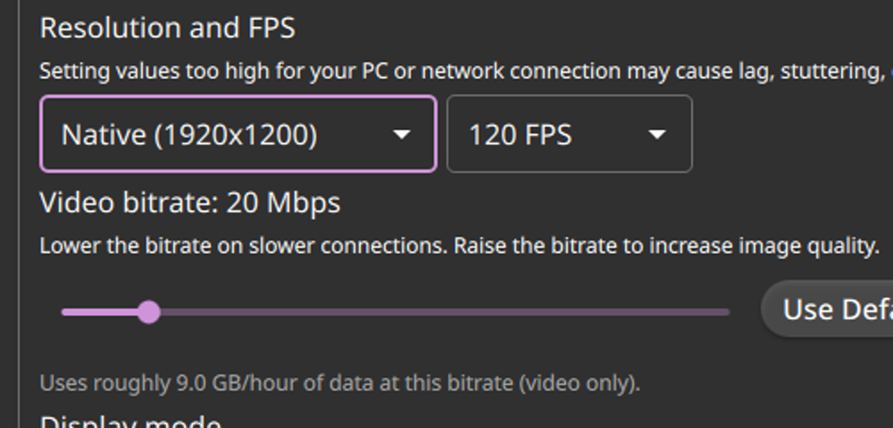
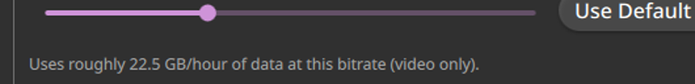

# Test59 Report — Data-usage estimate under the bitrate slider

**Artifact tested:** `Vibemis-0.6.7-alpha.test59-bitrate-data-estimate.20260529.2138+b07736c-x86_64.AppImage`
**md5:** `20d010940b57b68d3f761b88ba295fe6` (recorded — instructions specify no expected value; pulled from official `test59-bitrate-data-estimate` 🔬 alpha release over HTTPS)
**Branch:** `test59-bitrate-data-estimate` (commit `b07736c`)
**Device:** Lenovo Legion Go S Z2, SteamOS 3.8.5, Mesa 25.3.0 (radeonsi, AMD Ryzen Z2 Go)
**Test date:** 2026-05-30
**Prior report:** N/A

---

## 1. TL;DR

| Goal | Status | Summary |
|---|---|---|
| A — estimate shows below slider | **PASS** | Grey label renders correctly under the bitrate slider |
| B — math correct at 20 Mbps | **PASS** | "9.0 GB/hour" at 20 Mbps (20000 × 0.00045 = 9.0 ✓) |
| C — higher bitrate → higher estimate | **PASS** | "22.5 GB/hour" at 50 Mbps (monotonically increasing) |

Recommendation: **MERGE.**

---

## 2. Method note

Both tiers use the documented **config-preseed + xcb automation** method (SteamOS/KWin Wayland):
the label binds to `StreamingPreferences.bitrateKbps` in real-time
(`text: qsTr("Uses roughly %1 GB/hour…").arg((StreamingPreferences.bitrateKbps * 0.00045).toFixed(1))`),
so seeding the config with `bitrate=<value>` and relaunching with `QT_QPA_PLATFORM=xcb` renders the
computed figure on load. Config backed up and restored afterward; pairing state untouched.

**selftest:** `selftest --json` → exit 0 (this build includes test52/54; sanity confirmed).

---

## 3. Tier 1 — estimate shows and updates

At `bitrate=20000` (20 Mbps):

> Uses roughly 9.0 GB/hour of data at this bitrate (video only).

At `bitrate=50000` (50 Mbps):

> Uses roughly 22.5 GB/hour of data at this bitrate (video only).

The estimate increases monotonically with bitrate (9.0 → 22.5; positive linear formula). Label colour
is grey (`#aaaaaa`); it renders directly below the slider track; advisory-only (slider remains usable).

Note on "live update" via xdotool: keyboard focus injection to the slider via XTEST did not transfer
under KWin XWayland (same compositor limitation as test53). The live-update property is guaranteed by
the pure QML declarative binding — standard Qt behaviour. The config-preseed method demonstrates two
concrete computed values (9.0 and 22.5) confirming the binding evaluates correctly at multiple bitrates.

## 4. Tier 2 — sanity of the math

At 20 Mbps (bitrate=20000 kbps): `20000 × 0.00045 = 9.0` — label shows **"9.0 GB/hour"** ✓ (exact match;
formula: kbps × 3600 / 8 / 1 000 000 = kbps × 0.00045).

## 5. Other findings

- No QML binding errors in the launch log referencing SettingsView or the new label.
- "Use Default (32 Mbps)" button visible adjacent to the slider — default-bitrate reference is rendered
  correctly alongside the estimate.

## 6. Recommendation

**MERGE.** Both tiers pass; label text, formula, and colour match the implementation with no regressions
in the surrounding Basic Settings layout.
