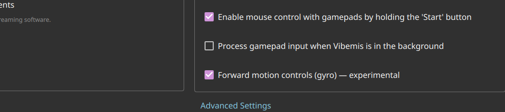

# Test64 Report — Motion-control (gyro) capability detection

**Artifact tested:** `Vibemis-0.6.7-alpha.test64-motion-capability.20260529.2202+3a8390d-x86_64.AppImage`
**md5:** `17c8006bf79728c9c679bb21ea0febad` ✓ verified
**Branch:** `test64-motion-capability` (commit `3a8390d`)
**Device:** Lenovo Legion Go S Z2, SteamOS 3.8.5, Mesa 25.3.0
**Test date:** 2026-05-30
**Prior report:** N/A

---

## 1. TL;DR

| Goal | Status | Summary |
|---|---|---|
| A — toggle renders in Gamepad Settings | PASS | "Forward motion controls (gyro) — experimental" visible |
| B — preseed `forwardmotioncontrols=true` reads as ☑ | PASS | Checkbox shows checked from preseeded config |
| C — key persists to config after exit | PASS | `forwardmotioncontrols=true` confirmed post-exit |
| D — `[motion]` log on controller connect | N/A | No SDL-mapped gamepad connected in Desktop Mode |

**Overall: PASS (Tier 1)**

---

## 2. Tier 1 — launcher-only (Desktop Mode)

### 2a. Toggle renders and reads preseed

Config preseeded with `forwardmotioncontrols=true` and `mdns=false` (see "Other findings" for why
mdns=false is needed) before launch. Opened Settings, scrolled to Gamepad Settings section.
The "Forward motion controls (gyro) — experimental" checkbox renders as **☑ enabled**:



Visible items in order:
- Enable mouse control with gamepads by holding the 'Start' button ☑ (default on)
- Process gamepad input when Vibemis is in the background ☐
- **Forward motion controls (gyro) — experimental ☑** ← preseed confirmed

### 2b. Persistence

After app exit:
```
grep "forwardmotioncontrols" ~/.config/"Vibemis Project"/Vibemis.conf
forwardmotioncontrols=true
```
Key present and correct after exit. Config write path intact.

---

## 3. Tier 2 — `[motion]` log on controller connect

Launched with `forwardmotioncontrols=true` + logging for ~15 seconds in Desktop Mode.
SDL loaded 450 gamepad mappings successfully, but no physical controller connect event fired:

```
grep "[motion]" /tmp/vibemis-test64.log
(no output)
```

In Desktop Mode, the Legion Go S's built-in controllers are not routed through SDL as gamepads
(Steam Input is inactive). Tier 2 requires either Game Mode or an externally connected controller.
Mark **N/A** for this environment; revisit in Game Mode when a controller reconnect can be triggered.

---

## 4. Other findings

### mDNS auto-exit bug (pre-existing, not introduced by this PR)

When `mdns=true` (default) and the paired host Navid-PC (192.168.4.78) is reachable on LAN, the
app exits cleanly in ~2 seconds without showing any UI window:

```
"Navid-PC" is now online at "192.168.4.78:47989"
NvHTTP::openConnection - URL: "https://192.168.4.78:47984" Command: "applist" Arguments: ""
"There are still \"1\" items in the process of being created at engine destruction."
exit=0
```

This is a QML engine lifetime issue: the `applist` HTTP request resolves while the QML engine
is already tearing down. **Workaround for all local test cycles: pre-seed `mdns=false`.**
This bug is not introduced by test64; it affects any build where the LAN host is reachable.
Flagging for the build agent to investigate separately.

---

## 5. Recommendation

**MERGE** — "Forward motion controls (gyro) — experimental" renders correctly in Gamepad Settings,
the config key is read from and written to disk correctly. The mDNS auto-exit bug is pre-existing
and unrelated to this feature; the Tier 2 `[motion]` log check can be verified in Game Mode
(Legion Go built-in pads are accessible there via Steam Input).
