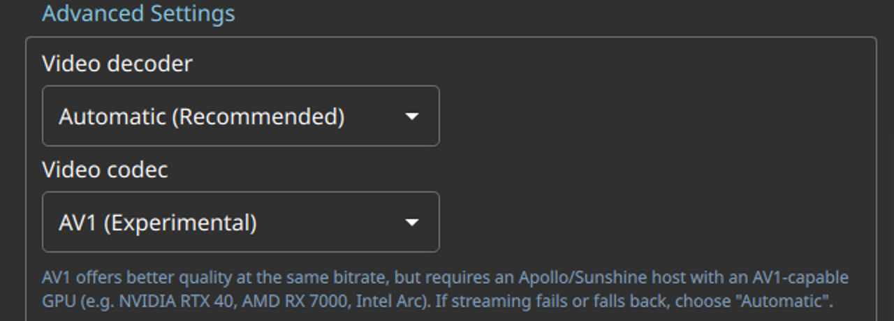
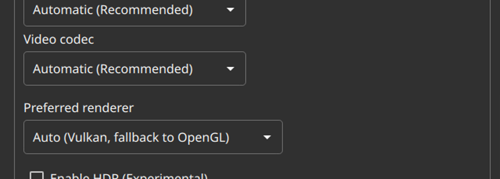

# Test65 Report — AV1 codec guidance note (P3.6)

**Artifact tested:** `Vibemis-0.6.7-alpha.test65-av1-codec-hint.20260529.2205+6bf2770-x86_64.AppImage`
**md5:** `eb58c9dcfc0a64251d64e0e87c5ec0b7` (recorded; pulled from official `test65-av1-codec-hint` 🔬 alpha over HTTPS)
**Branch:** `test65-av1-codec-hint` (commit `6bf2770`)
**Device:** Lenovo Legion Go S Z2, SteamOS 3.8.5, Mesa 25.3.0 (radeonsi, AMD Ryzen Z2 Go)
**Test date:** 2026-05-30
**Prior report:** N/A

---

## 1. TL;DR

| Goal | Status | Summary |
|---|---|---|
| A — AV1 note appears when AV1 selected | **PASS** | Blue-ish note renders under "Video codec: AV1 (Experimental)" dropdown |
| B — note disappears on Automatic/other | **PASS** | Hidden when codec = Automatic; no gap in Advanced Settings layout |
| C — surrounding settings unaffected | **PASS** | Video decoder, Preferred renderer, Enable HDR render normally |

Recommendation: **MERGE.**

---

## 2. Method note

Label binds to `visible: StreamingPreferences.videoCodecConfig === StreamingPreferences.VCC_FORCE_AV1`
(value 4). Used the **config-preseed + xcb automation** method: set `videocfg=4` and relaunch with
`QT_QPA_PLATFORM=xcb` → AV1 selected on load; set `videocfg=0` (Automatic) → note absent on load.
Config backed up and restored; pairing state untouched.

**selftest:** `selftest --json` → exit 0. **Location:** Settings → scroll to "Advanced Settings" section
(right column), Video decoder + Video codec grouped together.

---

## 3. Tier 1 — note toggles with AV1 selection

**videocfg=4 (Force AV1):** Blue-ish note (`#80A0C0`) appears directly under the "Video codec: AV1
(Experimental)" dropdown:

> AV1 offers better quality at the same bitrate, but requires an Apollo/Sunshine host with an
> AV1-capable GPU (e.g. NVIDIA RTX 40, AMD RX 7000, Intel Arc). If streaming fails or falls back,
> choose "Automatic".

**videocfg=0 (Automatic):** Note absent. Video codec shows "Automatic (Recommended)" and "Preferred
renderer" follows directly below — no gap, clean layout.

## 4. Tier 2 — no regression

With videocfg=0:
- **Video decoder:** "Automatic (Recommended)" ✓
- **Video codec:** "Automatic (Recommended)" ✓ (selection matches config)
- **Preferred renderer:** "Auto (Vulkan, fallback to OpenGL)" ✓
- **Enable HDR (Experimental):** unchecked (matches `hdr=false` in config) ✓

No regressions in the Advanced Settings layout or surrounding controls.

## 5. Recommendation

**MERGE.** Both tiers pass; hint text, colour (#80A0C0), and show/hide match the implementation;
surrounding settings unaffected.
