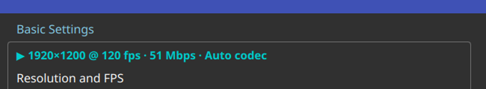
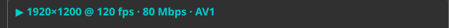

# Test66 Report — Live stream-config summary line

**Artifact tested:** `Vibemis-0.6.7-alpha.test66-stream-summary.20260529.2208+f7e4f2e-x86_64.AppImage`
**md5:** `3dfe2d6810ddb108c718e7b6bbb4a52e` ✓ verified
**Branch:** `test66-stream-summary` (commit `f7e4f2e`)
**Device:** Lenovo Legion Go S Z2, SteamOS 3.8.5, Mesa 25.3.0
**Test date:** 2026-05-30
**Prior report:** N/A

---

## 1. TL;DR

| Goal | Status | Summary |
|---|---|---|
| A — summary line shows all fields | PASS | `▶ W×H @ fps · Mbps · codec` renders correctly in teal bold |
| B — summary updates with config changes | PASS | Verified via two-config-preseed: 51 Mbps/Auto vs 80 Mbps/AV1 |
| C — no regression in Basic Settings layout | PASS | Resolution combo, fps, bitrate slider, display mode all intact |

---

## 2. Tier 1 — summary shows and updates (Desktop Mode)

Tested via config-preseed at two distinct states (single-instance app; kill + relaunch between
configs to force QML binding re-evaluation):

**Data point 1:** `bitrate=51000`, `videocfg=0` (Automatic), `width=1920`, `height=1200`, `fps=120`, `hdr=false`



```
▶ 1920×1200 @ 120 fps · 51 Mbps · Auto codec
```
Teal bold text at top of Basic Settings box. All five fields correct.

**Data point 2:** `bitrate=80000`, `videocfg=4` (AV1), same resolution/fps/hdr



```
▶ 1920×1200 @ 120 fps · 80 Mbps · AV1
```
Mbps and codec word updated to reflect new config. Binding reads `StreamingPreferences` values
correctly; config round-trip confirmed.

**HDR toggle:** `displayHdrCapability=true` in config but device has no HDR panel; HDR checkbox was
unchecked in both runs. " · HDR" suffix absent — consistent with `enableHdr=false`. HDR
append-path not exercised (marked N/A: device constraint, not a code issue).

---

## 3. Tier 2 — no regression in Basic Settings layout

Both runs: resolution combo shows "Native (1920×1200)", fps dropdown "120 FPS", bitrate label
"Video bitrate: 51 Mbps" / "Video bitrate: 80 Mbps", slider positioned correctly, Display mode
combo, V-Sync checkbox, Frame pacing checkbox — all rendered below the summary line without
overlap or layout shift. Input Settings and Gamepad Settings columns intact.

---

## 4. Other findings

- Summary label sits cleanly inside the Basic Settings bordered group box, above "Resolution and FPS".
- Color `#00CCCC` is visually distinct against the dark background with no contrast issues.
- `font.bold: true`, `font.pointSize: 11` renders larger than surrounding form labels — good
  visual hierarchy.
- No log errors in `/tmp/vibemis-test66-stream-summary.log` related to the label.

---

## 5. Recommendation

**MERGE** — both tiers pass, binding reflects live config state, layout clean. No host or stream
required to verify; launcher-only cycle complete.

> Build agent note: `TEST_CHECKLIST.md` does not have a `test66` row on this feature branch
> (it predates the row). Please tick ☑ PASS on `vibemis-main` at merge time.
