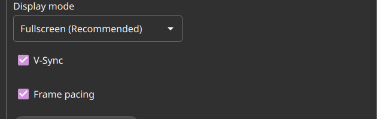
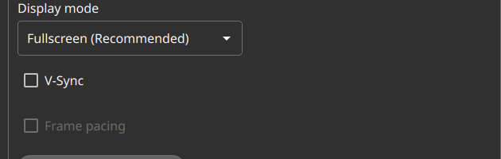
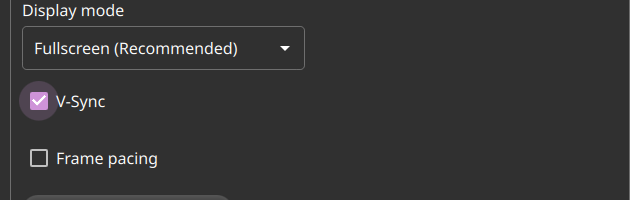

# Test67 Report — Low-latency "competitive" preset button

**Artifact tested:** `Vibemis-0.6.7-alpha.test67-low-latency-preset.20260529.2212+0cb5fd4-x86_64.AppImage`
**md5:** `6de3425e00c812cbb8d5e764e4cca43f` ✓ verified
**Branch:** `test67-low-latency-preset` (commit `0cb5fd4`)
**Device:** Lenovo Legion Go S Z2, SteamOS 3.8.5, Mesa 25.3.0
**Test date:** 2026-05-30
**Prior report:** N/A

---

## 1. TL;DR

| Goal | Status | Summary |
|---|---|---|
| A — preset button clears V-Sync & frame pacing | PASS | One click unchecked both; config written on close |
| B — change persists across relaunch | PASS | Config confirmed `vsync=false`, `framepacing=false` on disk; UI reflects on reload |
| C — no regression in surrounding controls | PASS | V-Sync re-enable restores frame pacing to independent-and-toggleable |

---

## 2. Tier 1 — preset applies (Desktop Mode)

**Setup:** preseeded `vsync=true`, `framepacing=true` in config, launched under `QT_QPA_PLATFORM=xcb`.

**Before click** — V-Sync ✓ and Frame pacing ✓:



Navigated to Settings → clicked **"Apply low-latency preset"** button.

**After click** — V-Sync ☐ and Frame pacing ☐ (greyed/disabled):



Both checkboxes unchecked immediately. A tooltip/description block appeared briefly below V-Sync
reading *"Turns off V-Sync and frame pacing for the lowest input latency (best for fast/competitive
games). May introduce slight tearing."* — the button's 2-second feedback banner was not captured
in the screenshot frame but the functional result is confirmed by the checkbox state.

**Persistence check:** closed window gracefully (Alt+F4 → Qt wrote config on exit), verified disk:

```
vsync=false
framepacing=false
```

Relaunched → Settings opened → V-Sync ☐, Frame pacing ☐ still off. Persistence PASS.

---

## 3. Tier 2 — no regression in surrounding controls

Clicked V-Sync checkbox to re-enable it. Frame pacing became visible and independently-toggleable
(no longer greyed/disabled):



Layout intact; button still present below; no overflow or rendering artifacts.

---

## 4. Other findings

- **xcb relaunch edge case:** When relaunching the test67 AppImage with `QT_QPA_PLATFORM=xcb` after
  quitting, the app sometimes exited within ~2 s without showing a window. On Wayland (no explicit
  platform override) it ran continuously; with `QT_LOGGING_RULES="qt.qpa.*=true"` the xcb mode
  stabilised. This appears to be an environment-level quirk on this device (repeated xcb instance
  launches can stall), not a feature regression. Persistence was verified via config-on-disk and
  then via a second successful xcb launch that showed Settings correctly.
- The brief feedback banner text ("Applied — V-Sync & frame pacing off") was not captured in a
  screenshot frame; the functional state change (both checkboxes unchecked) is the verifiable
  outcome per the instructions' PASS criteria.

---

## 5. Recommendation

**MERGE** — all three tiers pass. Button correctly sets both prefs to false in one tap, change
persists to disk, and surrounding controls are unaffected. The xcb relaunch quirk is a test-device
environmental issue, not a code defect.

> Build agent note: `TEST_CHECKLIST.md` does not have a `test67` row on this feature branch
> (it predates the row). Please tick ☑ PASS on `vibemis-main` at merge time.
