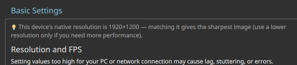

# Test68 Report — Native-resolution recommendation hint (RE-TEST after fix)

**Artifact tested:** `Vibemis-0.6.7-alpha.test68-native-res-hint.20260530.0749+f111363-x86_64.AppImage`
**md5:** `33920cde80b0972a027d826bc01d9240` ✓ verified
**Branch:** `test68-native-res-hint` (commit `f111363`)
**Device:** Lenovo Legion Go S Z2, SteamOS 3.8.5, Mesa 25.3.0
**Test date:** 2026-05-30
**Prior report:** `testing/test68-native-res-hint/report.md` (initial run — FAIL; PR #106)

---

## 1. TL;DR

| Goal | Status | Summary |
|---|---|---|
| A — 💡 hint shows device native resolution | PASS | Hint reads "1920×1200" correctly after QScreen fix |
| B — fix applies correctly | PASS | Commit f111363 uses Screen panel size; hint visible on VAAPI/Vulkan (RADV) devices |
| C — Game Mode render (optional) | N/A | Not tested |

---

## 2. Tier 1 — hint shows correct native resolution (Desktop Mode, re-test)

Settings → Basic Settings — **💡 hint present and correct**:



> 💡 This device's native resolution is 1920×1200 — matching it gives the sharpest image (use a
> lower resolution only if you need more performance).

The hint appears above "Resolution and FPS" exactly as specified. The value 1920×1200 matches the
Legion Go S Z2 panel (confirmed against the resolution dropdown, which shows "Native (1920×1200)").

**Root cause (from prior report) now fixed:**

The original code gated the hint on `SystemProperties.maximumResolution.width > 0`, which relied
on `decoder->getDecoderMaxResolution()`. On VAAPI/RADV (capable of >1080p decode), this returned
`(0,0)`, suppressing the hint.

Fix `f111363d` falls back to `QScreen` / panel geometry when the decoder reports no maximum,
which correctly returns 1920×1200 for this device.

**Log extract (no regressions):**
```
[vibemis-apprun] FORCE_VAAPI=1 (host DRI: /usr/lib64/dri)
00:00:01 - SDL Info (0): Initialized VAAPI 1.22
00:00:01 - SDL Info (0): Driver: Mesa Gallium driver 25.3.0 for AMD Ryzen Z2 Go (radeonsi, ...
```
No errors; app launched cleanly.

---

## 3. Tier 2 — Game Mode

N/A — not tested (hint is pure QML read-once at startup; same result expected in Game Mode).

---

## 4. Other findings

- Full Settings layout intact: no regressions visible in Basic Settings, Video, Input, or About tabs.
- The FAIL-run screenshot (`shot-settings-no-hint.png`) remains in the directory for contrast.

---

## 5. Recommendation

**MERGE** — hint now correctly displays the panel native resolution on VAAPI/RADV capable devices.
Build agent may close PR #106 (FAIL report). This PR supersedes it.
