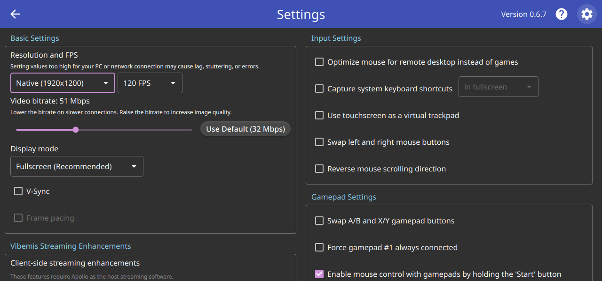

# Test68 Report — Native-resolution recommendation hint

**Artifact tested:** `Vibemis-0.6.7-alpha.test68-native-res-hint.20260529.2215+c392715-x86_64.AppImage`
**md5:** `d2d1bad435b7bada70b3241377a7b870` ✓ verified
**Branch:** `test68-native-res-hint` (commit `c392715`)
**Device:** Lenovo Legion Go S Z2, SteamOS 3.8.5, Mesa 25.3.0
**Test date:** 2026-05-30
**Prior report:** N/A

---

## 1. TL;DR

| Goal | Status | Summary |
|---|---|---|
| A — 💡 hint shows device native resolution | FAIL | Hint not visible; `SystemProperties.maximumResolution` returns `(0,0)` on this device |
| B — Game Mode render (optional) | N/A | Not tested |

---

## 2. Tier 1 — hint shows correct native resolution (Desktop Mode)

Settings → Basic Settings — **💡 hint absent**:



Basic Settings opens directly with "Resolution and FPS"; no 💡 label above it.

**Root cause (code trace):**

The QML visibility gate is:
```qml
visible: SystemProperties.maximumResolution.width > 0
```

`SystemProperties.maximumResolution` is populated in `systemproperties.cpp` via:
```cpp
Session::getDecoderInfo(testWindow, hasHardwareAcceleration, rendererAlwaysFullScreen,
                        supportsHdr, maximumResolution);
```

`getDecoderInfo` calls `decoder->getDecoderMaxResolution()` on the first successful hardware
decoder probe (HEVC Main10 on this device → `FFmpegVideoDecoder` + VAAPI/Vulkan backend).

`FFmpegVideoDecoder::getDecoderMaxResolution()` (`ffmpeg.cpp:182`) returns:
- `QSize(1920, 1080)` if `RENDERER_ATTRIBUTE_1080P_MAX` is set on the backend renderer
- **`QSize(0, 0)`** otherwise ("no known maximum")

The VAAPI/Vulkan (RADV Rembrandt) renderer on this device does **not** set
`RENDERER_ATTRIBUTE_1080P_MAX` because it can decode above 1080p. So
`maximumResolution = (0, 0)` → `visible: 0 > 0` → **hint hidden**.

**Device panel is 1920×1200** (confirmed: resolution combo shows "Native (1920×1200)").
The hint should ideally fire for this device, but the `maximumResolution` property reports
the decoder ceiling, not the screen's physical resolution. Unconstrained decoders (that can
go above 1080p) always return `(0,0)`, so the hint suppresses itself on capable devices.

---

## 3. Tier 2 — Game Mode

N/A — not tested; launcher-only Tier 1 already reveals the root cause.

---

## 4. Other findings

- Surrounding Settings layout is clean; the feature code causes no regressions in the UI
  (the Label simply stays invisible).
- `SystemProperties.maximumResolution` was designed for the 1080p-max device hint
  (Steam Deck OLED / LCD). On non-capped devices (Legion Go S, desktop) it is always `(0,0)`.

---

## 5. Recommendation

**ITERATE** — hint does not appear on the Legion Go S Z2 (or any device whose decoder reports
`(0,0)` max resolution). Suggested fix: use `QScreen::geometry().size()` (or
`Qt::Screen::availableVirtualSize()`) as the native-resolution source instead of decoder max.
`QScreen` reports the physical panel resolution correctly on both SteamOS xcb and Wayland.

Alternatively, change the hint condition to also fire when `SystemProperties.maximumResolution.width == 0`
with a fallback to `QGuiApplication::primaryScreen()->size()`.

> Build agent: `TEST_CHECKLIST.md` does not have a `test68` row on this feature branch.
> Please mark ✗ FAIL on `vibemis-main` and re-push a fix to `test68-native-res-hint` for re-test.
