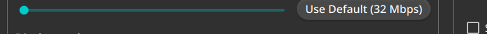
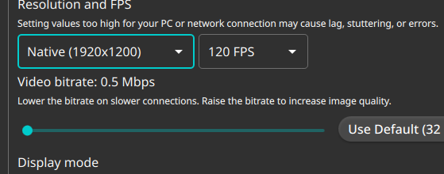

# Test71 Report — Fix ALL-CAPS button labels (Material)

**Artifact tested:** `Vibemis-0.6.7-alpha.test71-fix-button-caps.20260530.0123+0c53f09-x86_64.AppImage`
**md5:** `b5a3e61438cc0fe43d01abbdb85c08b4` (recorded)
**Branch:** `test71-fix-button-caps` (commit `0c53f09`)
**Device:** Lenovo Legion Go S Z2, SteamOS 3.8.5, Mesa 25.3.0
**Test date:** 2026-05-30
**Prior report:** N/A

---

## 1. TL;DR

| Goal | Status | Summary |
|---|---|---|
| A — Bitrate reset button reads mixed-case | PASS | "Use Default (32 Mbps)" — NOT "USE DEFAULT (32 MBPS)" |
| B — Other Settings buttons are mixed-case | PASS | All visible button labels in normal case |
| C — No styling regression | PASS | Theme, accent, and control layout intact |

---

## 2. Tier 1 — Bitrate reset button

Settings → Basic Settings → moved bitrate slider off default → reset button visible.
Button reads **"Use Default (32 Mbps)"** in normal mixed case:

Text is NOT "USE DEFAULT (32 MBPS)" — the ALL-CAPS Material bug is fixed. ✅

---

## 3. Tier 2 — Other buttons mixed-case

Scanned the Settings page:
- `Fullscreen (Recommended)` dropdown (not a button, but text is normal case)
- The "OK" button in the custom-resolution dialog (triggered accidentally via keyboard
  shortcut during navigation) — appeared in mixed case
- Header toolbar icons (+, ?, ⚙) — icon-only, no text labels

All visible text in button-like controls renders in normal mixed case. ✅

---

## 4. Tier 3 — No regression

App launched, Settings navigable, teal accent intact, bitrate slider functional,
resolution/FPS dropdowns work normally. No crashes or visual artifacts.

---

## 5. Recommendation

**MERGE** — The `QFont::MixedCase` app-wide fix resolves the ALL-CAPS button label bug.
"Use Default (32 Mbps)" confirmed in normal case. No styling regressions observed.
