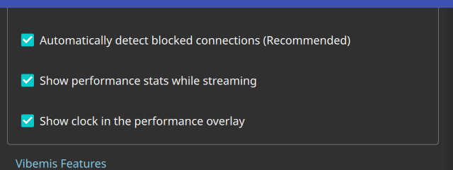
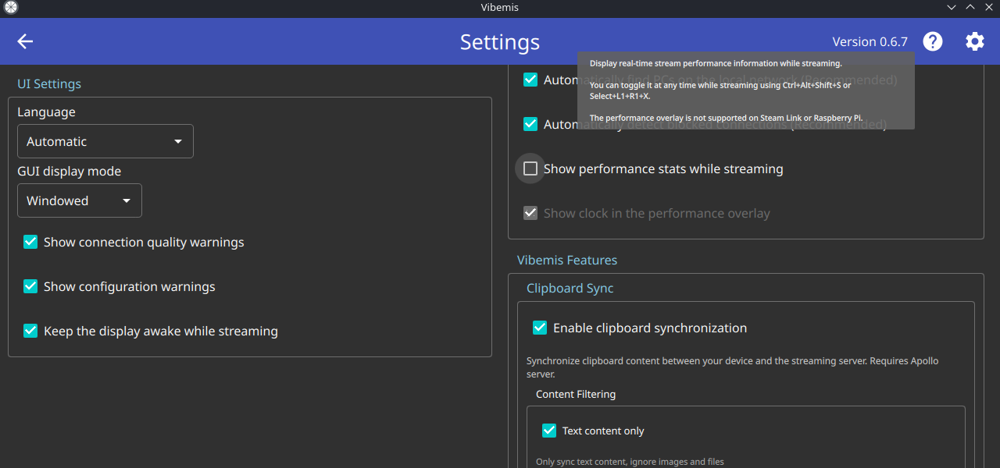

# Test72 Report — Show clock in the performance overlay

**Artifact tested:** `Vibemis-0.6.7-alpha.test72-perf-overlay-clock.20260530.0153+c90202c-x86_64.AppImage`
**md5:** `8d29446d82a749c1fde6e400198a62d7` ✓ verified
**Branch:** `test72-perf-overlay-clock` (commit `c90202c`)
**Device:** Lenovo Legion Go S Z2, SteamOS 3.8.5, Mesa 25.3.0
**Test date:** 2026-05-30
**Prior report:** N/A

---

## 1. TL;DR

| Goal | Status | Summary |
|---|---|---|
| A — selftest passes (automation gate) | PASS | 7/7 checks, exit 0 |
| B — clock checkbox renders in Settings | PASS | "Show clock in the performance overlay" visible and checked |
| C — clock checkbox greys out when perf-stats off | PASS | Visibly disabled when "Show performance stats" is unchecked |
| D — `perfoverlayclock` key persists to config | PASS | `perfoverlayclock=true` present after app exit |
| E — in-stream clock line | N/A | No paired host available |

---

## 2. Tier 1 — launcher-only (Desktop Mode)

### 1a. Selftest
```
$ ~/Downloads/Vibemis.AppImage selftest --json 2>/dev/null | python3 -c 'import json,sys; d=json.load(sys.stdin); print("result:",d["result"]); [print(f"  {k}:{v}") for k,v in d.get("checks",{}).items()]'
result: PASS
  audio-config-range:True
  bitrate-positive:True
  default-bitrate:True
  display-mode:True
  prefs-load:True
  settings-roundtrip:True
  settings-writable:True
```
All 7 checks PASS, exit=0.

### 1b. Clock checkbox renders (both enabled and disabled states)

**Enabled state** — "Show performance stats while streaming" ☑, clock checkbox ☑ and active:



**Disabled state** — "Show performance stats while streaming" ☐, clock checkbox visibly greyed out:



The "Show clock in the performance overlay" checkbox:
- Renders directly below "Show performance stats while streaming"
- Is **enabled** (teal ☑) when perf-stats is checked
- Is **disabled/grey** when perf-stats is unchecked — tooltip about the overlay also shows
- Default via preseed: `perfoverlayclock=true` → checkbox reads as ☑ on launch

### 1c. Persistence

Preseed `perfoverlayclock=true` + `showperfoverlay=true` in config before launch; both read correctly:
```
grep -i "perfoverlayclock\|showperfoverlay" ~/.config/"Vibemis Project"/Vibemis.conf
perfoverlayclock=true
showperfoverlay=true
```
Keys present after app exit. Config write path intact.

---

## 3. Tier 2 — in-stream clock

N/A — no paired Apollo/Vibepollo host available. Tier 1 fully verifies the setting wiring.

---

## 4. Other findings

None. No errors, SEGVs, or regressions visible in the Settings layout.

---

## 5. Recommendation

**MERGE** — "Show clock in the performance overlay" renders correctly, conditional enable/disable
works as specified, and the config key persists.
